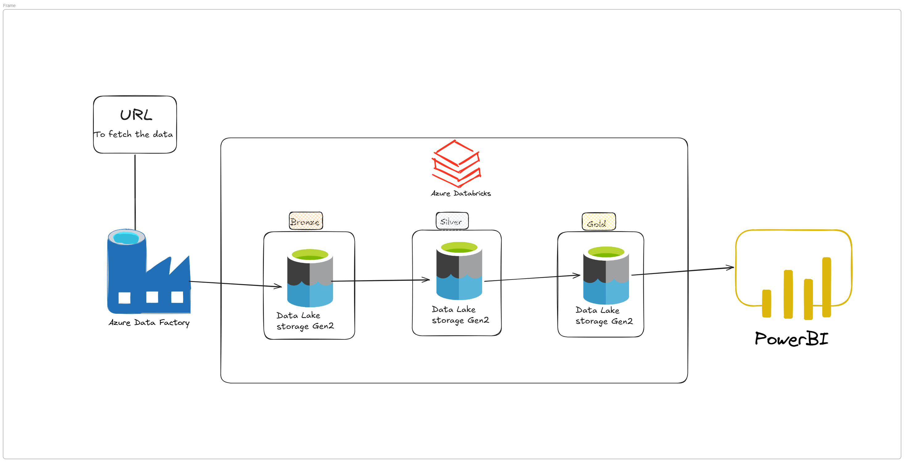
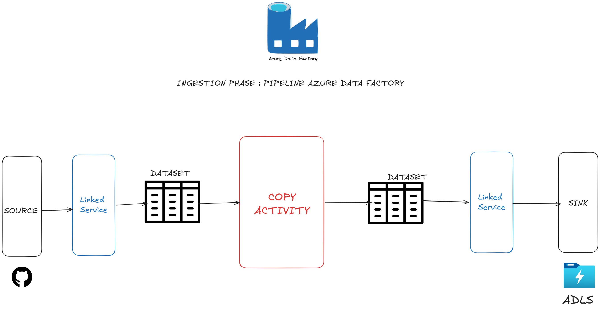
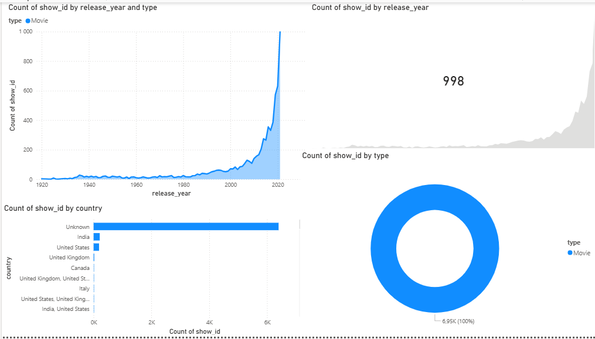

# Azure End-to-End Data Engineering Pipeline: Amazon Prime Titles

## 📌 Project Overview
This project demonstrates the implementation of a **Modern Data Stack** on Microsoft Azure. It automates the extraction, transformation, and loading (ETL) of the **Amazon Prime Titles** dataset
  into a centralized data lake using the **Medallion Architecture** (Bronze, Silver, and Gold layers).

The goal is to provide actionable business insights through a scalable and automated cloud infrastructure.

## 🏗️ Architecture

## 🛠️ Tech Stack
* **Orchestration:** Azure Data Factory (ADF)
* **Data Lake:** Azure Data Lake Storage (ADLS) Gen2
* **Data Processing:** Azure Databricks (PySpark)
* **Visualization:** Power BI

## ⚡ Data Pipeline Workflow
The project follows a modular ETL approach:
1.  **Ingestion (Bronze):** Raw data is extracted from [Kaggle – Amazon Prime Movies and TV Shows](https://www.kaggle.com/datasets/shivamb/amazon-prime-movies-and-tv-shows) via Azure Data Factory and stored in the Bronze container in its original format.

2.  **Transformation (Silver):** Databricks notebooks process the raw data by cleaning, handling missing values, and enforcing schema constraints.
3.  **Aggregation (Gold):** Data is modeled into enriched tables (category splits, date enrichment), ready for analytical consumption.
4.  **Serving:** The refined Gold data is exposed as a Delta table (`gold_layer.prime_gold`) and consumed directly by Power BI via Databricks SQL.
5.  **Visualization:** A Power BI dashboard connects to the Gold layer to track KPIs such as **number of titles added per year** and **top content categories by count**.

## 📊 Business Insights

## 🚀 Key Features
* **Scalability:** Managed through Databricks clusters and ADF triggers.
* **Security:** Sensitive credentials (connection strings, keys) are stored securely in **Azure Key Vault** and accessed via Databricks secrets — never hard-coded.
* **Data Quality:** Basic data validation and null-handling during the Silver transformation phase.
* **Automation:** End-to-end orchestration using ADF pipelines.

## 🔒 Security
Never commit Azure Storage account keys, SAS tokens, or any secrets to this repository.
Use `dbutils.secrets.get(scope="<scope>", key="<key>")` in Databricks notebooks, backed by Azure Key Vault.

## 📂 Repository Structure
* `/dataset`: Sample CSV source data and schema documentation.
* `/notebooks`: PySpark notebooks for Silver and Gold transformations.
* `/architecture`: System design diagrams.
* `/images`: Screenshots and visual assets for documentation.

---
**Author:** Abdallah ASSOUMANOU
*Engineering Student specializing in Data Engineering and AI*
